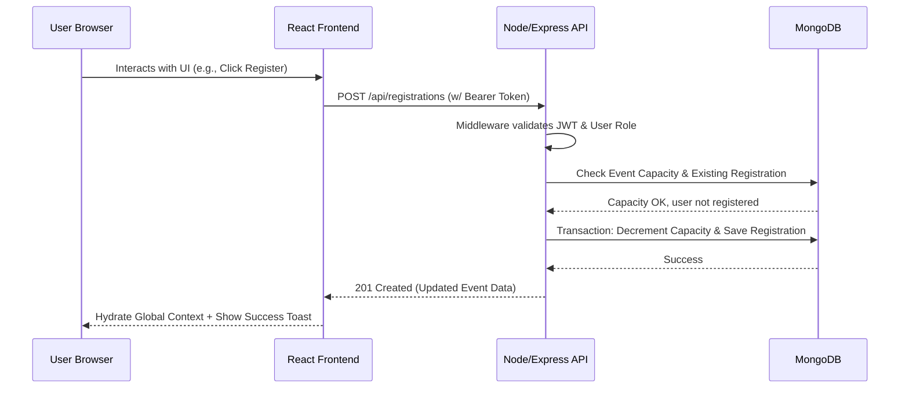

<p align="center">
  
</p>

# 🎉 EventFlow: The Unified University Event Management Ecosystem

<p align="center">
  
  
  
  
  
  
</p>

<p align="center">
  <i>A professional, highly-polished full-stack web application designed to centralize campus discovery, student engagement, and event analytics. Built from the ground up to solve the fractured nature of university communications, EventFlow provides a single source of truth for all Academic, Sports, Cultural, and Technical events.</i>
</p>

---

## 📑 Table of Contents
1. [📖 About The Project](#-about-the-project)
2. [✨ Detailed Features](#-detailed-features)
   - [For Students](#for-students)
   - [For Administrators](#for-administrators)
3. [🏗️ Technical Architecture](#-technical-architecture)
4. [🗄️ Database Schema & Relationships](#️-database-schema--relationships)
5. [📡 Comprehensive API Reference](#-comprehensive-api-reference)
6. [🔐 Security & Data Integrity](#-security--data-integrity)
7. [🚀 Getting Started (Installation & Setup)](#-getting-started-installation--setup)
   - [Prerequisites](#prerequisites)
   - [Environment Variables](#environment-variables)
   - [Installation Steps](#installation-steps)
8. [📂 Folder Structure](#-folder-structure)
9. [👨‍🏫 Testing & Demo Credentials](#-testing--demo-credentials)
10. [🔮 Future Roadmap](#-future-roadmap)
11. [👨‍💻 Author & License](#-author--license)

---

## 📖 About The Project

University campuses often suffer from "information fragmentation." Event details are scattered across emails, notice boards, WhatsApp groups, and independent websites. 

**EventFlow was built to solve this.**

It provides a sophisticated, centralized platform where Organizers (Admins) can seamlessly publish and manage events, while Students can discover, track, and register for them in real-time. By utilizing a modern tech stack and a sleek, developer-centric UI, EventFlow ensures high adoption rates and actionable analytics for the university.

### Why MERN?
- **MongoDB**: Schema flexibility allows events of varying types (workshops to multi-day fests) to exist seamlessly without rigid table constraints.
- **Express + Node.js**: High-throughput, non-blocking asynchronous event handling ensures fast API responses even during registration spikes.
- **React + Vite**: Delivers incredibly fast Hot Module Replacement during development and blazing-fast optimized static bundles for production, resulting in a buttery-smooth Single Page Application (SPA).

---

## ✨ Detailed Features

### For Students
*   **Centralized Event Discovery Engine**: Browse all university events across dynamic categories (Academic, Sports, Cultural, Technical).
*   **Frictionless Registration (Atomic Updates)**: One-click registration that instantly updates the backend capacity counters atomically, preventing overbooking.
*   **"My Events" Interactive Dashboard**: A personalized hub displaying registered events. Clicking on any registered event card seamlessly routes you to its detailed analytics and metadata page.
*   **Intelligent Search Context**: Instantly filter events by name, date, or category using a debounced search bar optimized for performance.
*   **Modern UI/UX**: Enjoy a sleek, dark-themed UI featuring glassmorphism elements, subtle CSS animations (`framer-motion`), and highly legible typography.

### For Administrators
*   **Event Lifecycle Management**: Full CRUD permissions to create comprehensive event listings with rich metadata (date, time, venue, strict attendee capacities).
*   **Student Directory & Reporting**: Instantly search a global directory of all registered students by ID or Department to track engagement.
*   **Real-time Analytics Dashboard**: Visualize high-level metrics including total student reach, upcoming event counts, and capacity utilization metrics.
*   **Administrative Quick Actions**: Easily spot and quickly modify high-priority upcoming events from the main command center.

---

## 🏗️ Technical Architecture

EventFlow utilizes a highly scalable **Client-Server Architecture**. The React Client handles all state and UI, while the Node.js API acts as a secure data broker.

### Data Flow Diagram


### Core Architecture Decisions
*   **Axios Interceptors for Robust Auth**: We employ global response interceptors that look for `401 Unauthorized`. If a token expires naturally or is invalidated, the interceptor automatically clears local storage and gently redirects the user to the `auth` screen without manual error handling scattered across components.
*   **React Context for Global State**: The `AuthContext` and `EventContext` act as lightweight state managers, preventing prop-drilling and ensuring that the logged-in user and their current registrations are globally accessible to protected routes and component renders.

---

## 🗄️ Database Schema & Relationships

EventFlow uses a NoSQL database via `mongoose` Object Data Modeling (ODM).

### Core Collections
1.  **Users** (`User.js`):
    *   Stores core identity (`name`, `email`, hashed `password`).
    *   Roles drive the UI experience: `enum: ['student', 'admin']`.
    *   Validation: Emails are strictly validated against domain policies via custom regex.
2.  **Events** (`Event.js`):
    *   Stores `title`, `description`, `date`, `time`, `venue` (Strings).
    *   `category` drives dashboard filtering logic (Enum).
    *   `capacity` sets the hard ceiling for attendees.
    *   `registered` dynamically counts current attendees against the capacity.
    *   `image` acts as an absolute or relative path to the event's banner aesthetic.
3.  **Registrations** (`Registration.js`):
    *   A critical junction table establishing a **Many-to-Many** relationship between Users and Events.
    *   **Crucial Index**: A compound unique index `User_Id + Event_Id` ensures idempotency—one student can never register for the same event twice.

---

## 📡 Comprehensive API Reference

The backend exposes a RESTful API wrapped in Express routers. All non-public endpoints require an `Authorization: Bearer <token>` header.

### Authentication (`/api/auth`)
| Method | Endpoint | Protection | Description | Payload | Returns |
|--------|----------|------------|-------------|---------|---------|
| POST | `/register` | Public | Register new user. Strongly enforces `@adityauniversity.in` for students & `@aditya.edu` for admins. | `{name, email, password, department, role}` | JWT Token + User Object |
| POST | `/login` | Public | Authenticate user and issue JWT. | `{email, password}` | JWT Token + User Object |
| GET | `/me` | Protected | Validate token and fetch current user profile. | *None* | User Object |

### Events (`/api/events`)
| Method | Endpoint | Protection | Description | Payload Constraints | Returns |
|--------|----------|------------|-------------|---------------------|---------|
| GET | `/` | Public | Fetch massive array of all listed events. | *QueryParams soon* | Array of Events |
| GET | `/:id` | Public | Fetch specific detailed metadata for one event. | URL Param: `id` | Single Event Object |
| POST | `/` | Admin Only | Create new event listing. | Event fields + capacity | Created Event |
| PUT | `/:id` | Admin Only | Update existing event listing details. | Selected fields | Updated Event |
| DELETE| `/:id` | Admin Only | Hard delete an event (cascades not implemented). | URL Param: `id` | Success Message |

### Registrations (`/api/registrations`)
| Method | Endpoint | Protection | Description | Payload | Returns |
|--------|----------|------------|-------------|---------|---------|
| GET | `/` | Protected | Fetch comprehensive history of specific user's registrations. Populates event references. | *None* | Array of Registrations |
| POST | `/` | Protected | Atomically register the current user for an event ID. Handles capacity validation constraints. | `{eventId}` | Registration Object |
| DELETE| `/:id` | Protected | Cancel a specific registration and increment backend capacity counter. | URL Param: `id` (Reg ID) | Success Message |

---

## 🔐 Security & Data Integrity

EventFlow prioritizes institutional security. 

### 🎓 Institutional Domain Enforcement
We prevent bad actors or unauthorized students from accessing the portal. During the `/register` API controller logic:
*   If `role` === 'student': Email string **must** end in `@adityauniversity.in`.
*   If `role` === 'admin': Email string **must** end in `@aditya.edu`.

### 🛡️ Secure Payload Handling
*   **Passwords**: Never stored in plaintext. Hashed globally using `bcryptjs` with salt rounds prior to MongoDB insertion.
*   **Authentication**: Managed securely via stateless JSON Web Tokens (JWT). The server verifies the cryptographic signature on every protected request. Tokens are short-lived.
*   **Data Validation**: Mongoose strictly enforces schema types, dropping any spurious or malicious payload fields automatically before document creation.

---

## 🚀 Getting Started (Installation & Setup)

Follow these precise steps to get a local development environment running.

### Prerequisites
Make sure you have installed:
*   **Node.js** (v18.x or higher)
*   **npm** (Node Package Manager)
*   **MongoDB Server** (Running locally on default port 27017, or a free MongoDB Atlas cloud cluster).
*   **Git**

### Environment Variables
You must configure your local environment credentials for the application to boot.

**1. Backend Variables**
Create a `.env` file in the `/Backend` directory:
```env
PORT=5000
MONGODB_URI=mongodb://127.0.0.1:27017/eventflow
# Replace this with a highly secure random string in production
JWT_SECRET=super_secret_eventflow_jwt_key_2026
NODE_ENV=development
```

**2. Frontend Variables**
Create a `.env` file in the `/Frontend` directory to point Vite to your backend:
```env
VITE_API_URL=http://localhost:5000/api
```

### Installation Steps

**Step 1: Clone the Repository**
```bash
git clone https://github.com/aaweshdas/Event-Flow---Project.git
cd Event-Flow---Project
```

**Step 2: Setup the Backend**
```bash
cd Backend
npm install
npm start
```
*The backend should successfully report `Server started on port 5000` and `MongoDB Connected`.*

**Step 3: Setup the Frontend**
Open a totally new terminal window:
```bash
cd Event-Flow---Project/Frontend
npm install
npm run dev
```
*Vite will launch the hot-reloading server, usually accessible at `http://localhost:5173`.*

---

## 📂 Folder Structure
The project is strictly organized to separate concerns between the API layer and the UI representation layer.

```text
Event-Flow---Project/
│
├── Backend/                 # The Node.js / Express API Server
│   ├── config/              # Database connection logic
│   ├── controllers/         # Core business logic (Auth, Events, Reg)
│   ├── middleware/          # JWT Verification & role checks
│   ├── models/              # Mongoose Schema Definitions
│   ├── routes/              # Express API endpoint mapping
│   ├── server.js            # Main application entry point
│   └── package.json         
│
├── Frontend/                # The React / Vite SPA Client
│   ├── public/              # Static assets (logos, images)
│   ├── src/                 
│   │   ├── components/      # Reusable UI (Buttons, Navbars, Modals)
│   │   ├── context/         # React Context (AuthContext, EventContext)
│   │   ├── pages/           # High-level views (Dashboard, Auth, Details)
│   │   ├── services/        # Axios API wrapper functions
│   │   ├── App.jsx          # Root routing configuration
│   │   ├── main.jsx         # DOM rendering entry point
│   │   └── style/           # Optional global design tokens
│   ├── index.html
│   ├── vite.config.js       # Bundler config
│   └── package.json
│
├── logo.png                 # The main project branding mark
└── README.md                # This comprehensive documentation file
```

---

## 👨‍🏫 Testing & Demo Credentials

If you have successfully connected to MongoDB, you must register these users first (or seed the DB) to test the unique flows.

**Student Account:**
*   Email: `24B11CS001@adityauniversity.in`
*   Password: `12345`
*   *Note: Registration will strictly enforce this domain format.*

**Administrative Account:**
*   Email: `aarav@aditya.edu`
*   Password: `12345`
*   *Note: Used to test event creation, attendee analytics, and dashboard global controls.*

---

## 🔮 Future Roadmap (V2.0 Scope)
- [ ] **Email Integration**: Integrate SendGrid or AWS SES to send automated emails upon successful event registration or cancellation.
- [ ] **QR Code Verification**: Generate dynamic QR codes for each registration. Admins can scan via mobile to physically check-in students at the venue.
- [ ] **Pagination/Infinite Scroll**: Implement cursor-based pagination for the events fetching endpoint to ensure snappy database queries as the event catalog grows massive.

---

## 👨‍💻 Author & License

Developed and engineered by **Aawesh Kumar Das** and the **EventFlow Team**.

This project is open-sourced software licensed under the **[MIT License](https://opensource.org/licenses/MIT)**. You are free to confidently deploy, scale, and modify this project to fit your institutional needs.

<p align="center">
  Thank you for exploring EventFlow! 🚀
</p>
